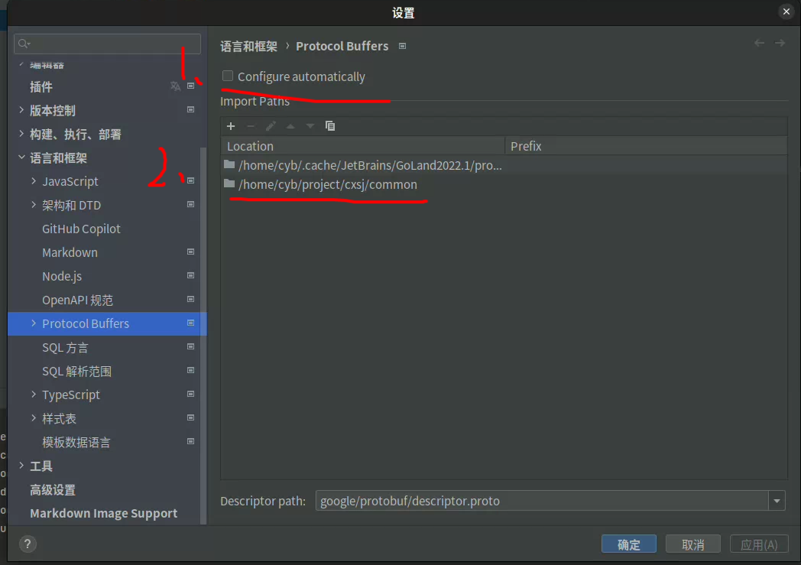

# common

idl 定义，工具库

# proto 相关教程文档

- [proto 与 json 之间的类型 mapping](https://www.0xsky.com/post?id=1031)
- [grpc-gateway 文档](https://grpc-ecosystem.github.io/grpc-gateway/docs/mapping/examples/)

# 常见问题

proto 文件 import 报错。在 idea 设置里进行如下配置。

